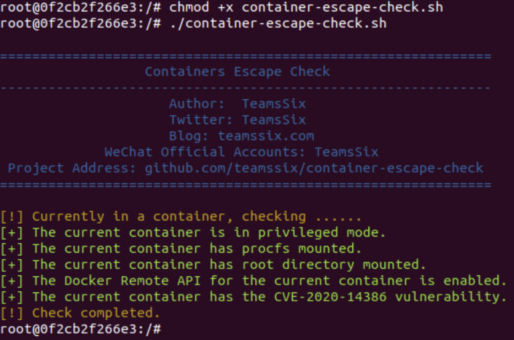

# Container Escape Check 容器逃逸检测

[](https://github.com/teamssix/container-escape-check) [](https://github.com/teamssix/container-escape-check/issues) [](https://github.com/teamssix/container-escape-check/releases)  [](https://github.com/teamssix) [](https://twitter.com/teamssix)


[中文](https://github.com/teamssix/container-escape-check/blob/master/README_ZH.md) | EN

# Introduce

This script is used to detect Docker container escape methods, The following methods are currently supported:

1. Privileged Mode
2. Mount docker Socket
3. Mount host procfs
4. Mount host root or etc directory
5. Open Docker Remote API
6. CVE-2016-5195 DirtyCow
7. CVE-2020-14386 
8. CVE-2022-0847 DirtyPipe
8. CVE-2017-1000112
8. CVE-2021-22555
8. Mount Host Var Log
8. CAP_DAC_READ_SEARCH (Requires container to support capsh command)
8. CAP_SYS_ADMIN (Requires container to support capsh command)
8. CAP_SYS_PTRACE (Requires container to support capsh command)
8. CVE-2022-0492

# ✨ Usage

Run this script with one command in the container.

```
wget https://raw.githubusercontent.com/teamssix/container-escape-check/main/container-escape-check.sh -O- | bash
```

Or clone the project to run in the container.

```
git clone https://github.com/teamssix/container-escape-check.git
cd container-escape-check
chmod +x container-escape-check.sh
./container-escape-check.sh
```



If it feels good, remember to give the project a little star ✨

# ⚠️ Notes

* This script needs to be run inside the docker container.
* Most of the detection methods here are based on my experience, and there may be false positives or omissions. If you find these problems, please submit an Issue.
* Some escape methods need to be judged according to the Docker version. I haven't thought of a way to get the Docker version from inside the container, so the script does not support the detection of this method yet.

# Changelog

## v0.3 2022.4.7

* Add CVE-2022-0492
* If the capsh command does not exist, it will be installed automatically
* Enhanced privileged mode detection
* Enhanced /var/log detection

## v0.2 2022.3.30

* Add CVE-2017-1000112
* Add CVE-2021-22555
* Add Mount Host Var Log
* Add CAP_DAC_READ_SEARCH
* Add CAP_SYS_ADMIN
* Add CAP_SYS_PTRACE

## v0.1 2022.3.18

* Add Privileged Mode
* Add Mount docker Socket
* Add Mount host procfs
* Add Mount host root or etc directory
* Add Open Docker Remote API
* Add CVE-2016-5195 DirtyCow
* Add CVE-2020-14386 
* Add CVE-2022-0847 DirtyPipe


